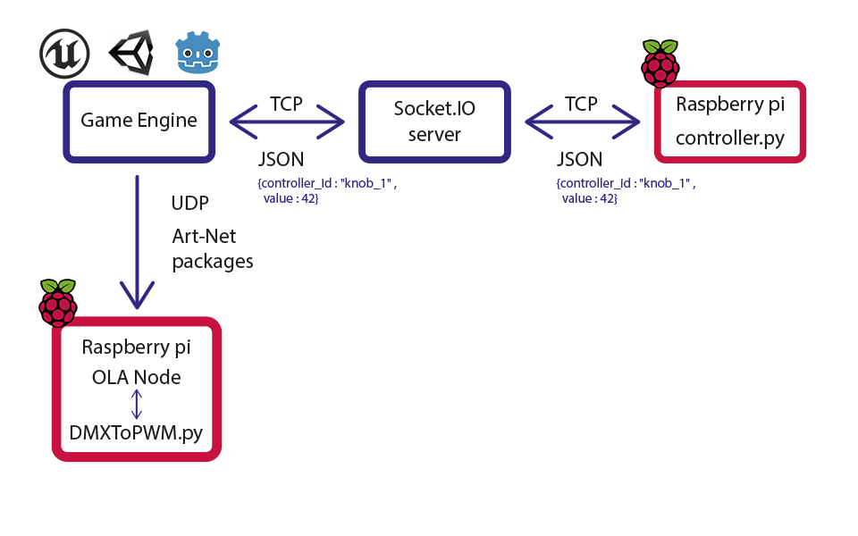

# CRKit - Crafteke Reality Kit

CRKit, standing for Crafteke Reality Kit, is an innovative technology toolkit developed by Crafteke. It is specially designed for building immersive and interactive experiences by bridging the gap between extended reality (XR) and physical reality.

## Under the hood

The CRKit uses Raspberry Pis connected with the game engine. Outputs are send through DMX packages to OLA instances hosted on RPis. User input are transmitted as JSON messages through the socketIO protocol. 



## Warning

This project is still totally dedicated to Dystopia Escape Game developpers. We plan to separate distinguished functions from each other and extract specific use cases, and write examples to integrate with game engines. Don't try to use this now by yourself. If you are interested into using our hardware/software solutions, contact us at [Crafteke](https://crafteke.be/)

## Features

- Affordability and Accessibility: CRKit integrates with Raspberry Pi and utilizes PCBs to remain cost-effective.
- Plug-and-Play: Immediate communication with the server upon connection for seamless interaction with the experience engine.
- Wide Range of Output Devices: Interacts with lighting, motors, LEDs, fans, lasers, magnetic locks, screen streaming, etc.
- Diverse Input Options: Supports classical buttons, knobs, NFC readers, AI-powered cameras, temperature sensors, capacitive touch sensors, and more.
- Network Compatibility: Operates via TCP and UDP network with a central server that streams user actions.
- Modular Design: Customizable and scalable; add or remove modules as needed.
- Unity Integration: Works seamlessly with the Unity game engine.
- Unreal Engine Integration (Coming Soon): We are actively working on integrating CRKit with Unreal Engine for broader application support.
- Real-world Testing: Extensively tested in real-world environments for reliability.

## Getting Started

### Prerequisites
- Raspberry Pi (with Raspbian OS installed)
- [Unity Game Engine](https://unity.com/) (for creating interactive experiences)
- [Unreal Engine](https://www.unrealengine.com/) (coming soon, for creating interactive experiences)

### Installation
1. Add the CSharp unity files (ControllerManager.cs and ArtNet.cs) into your unity project.
2. Install SocketIOClientDotNet: This C# library is used to connect to the Socket.IO server. To install it, you need to:
   - Go to Unity and click on Window > Package Manager.
   - Click on the + in the upper left corner, then Add package from git URL...
   - Enter https://github.com/doghappy/socket.io-client-csharp and click on Add.

### Usage
To control a specify DMX channel on a universe, just do:
```
using UnityEngine;

public class DmxExample : MonoBehaviour
{
    private artNet.DMXUniverse dmxUniverse;

    private void Start()
    {
        // Register a DMX universe with the specified ID, IP, and size
        dmxUniverse = artNet.registerUniverse(1, "DMX IP", 512);
    }

    private void Update()
    {
        // Add your logic here to update DMX channels
        dmxUniverse.setChannel(channelIndex, value);
    }
```
To get inputs from a specific controller, you have to:
```
using UnityEngine;
using System.Collections.Generic;

public class InputExample : MonoBehaviour
{
    // Dictionary to store controller values
    public static Dictionary<string, int> controller = new Dictionary<string, int>()
    {
        { "commandName", 0 }
    };

    // Constructor
    public InputExample(bool _go_down) : base()
    {
        // Subscribe to command events
        subscribeCommand("commandName");
    }

    // Event handler for commands
    public void commandsEvent(ControlAction ca)
    {
        // Update controller value based on received command
        controller[ca.controllerId] = ca.value;
    }

    private void Update()
    {
        // Check if the command is triggered
        if (controller["commandName"] == 1)
        {
            // Perform actions associated with the command
            controller["commandName"] = 0; // Reset the controller value
        }
    }

    public void subscribeCommand(string id)
    {
        // Implement your event subscription logic here
    }
}

public class ControlAction
{
    public string controllerId; // ID of the controller
    public int value; // Value associated with the command
    public string stringValue; // Optional string value

    public ControlAction(string controllerId, int value)
    {
        this.controllerId = controllerId;
        this.value = value;
    }

    public ControlAction(string controllerId, string stringValue)
    {
        this.controllerId = controllerId;
        this.stringValue = stringValue;
    }

    public override string ToString()
    {
        return "Command - ID: " + controllerId + " - Value: " + value;
    }
}
```
 
## License
This project is licensed under the MIT License - see the [LICENSE](link-to-license-file) file for details.

## Acknowledgments
We are seeking the Epic Mega Grant to expand the capabilities of CRKit. Your support helps us innovate and provide efficient solutions for creators globally.

---

*CRKit is a product of Crafteke, committed to pushing the boundaries of immersive and interactive experiences.*
